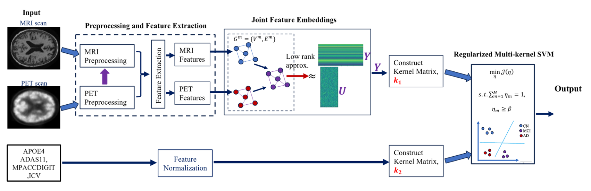
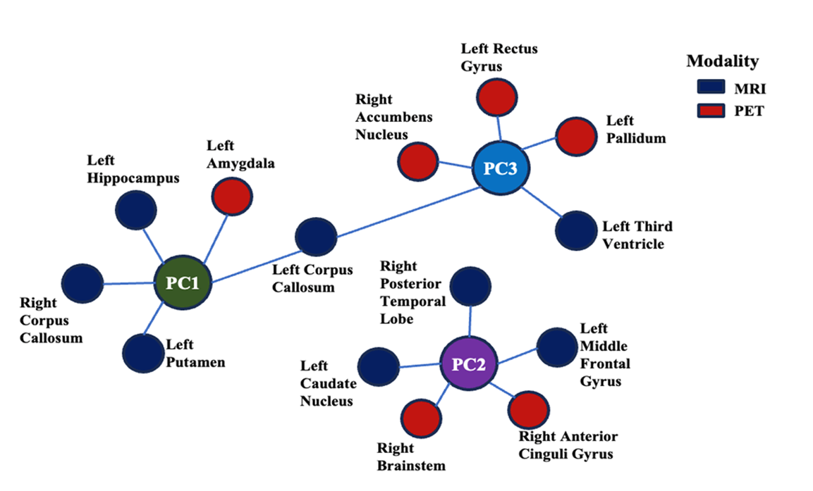
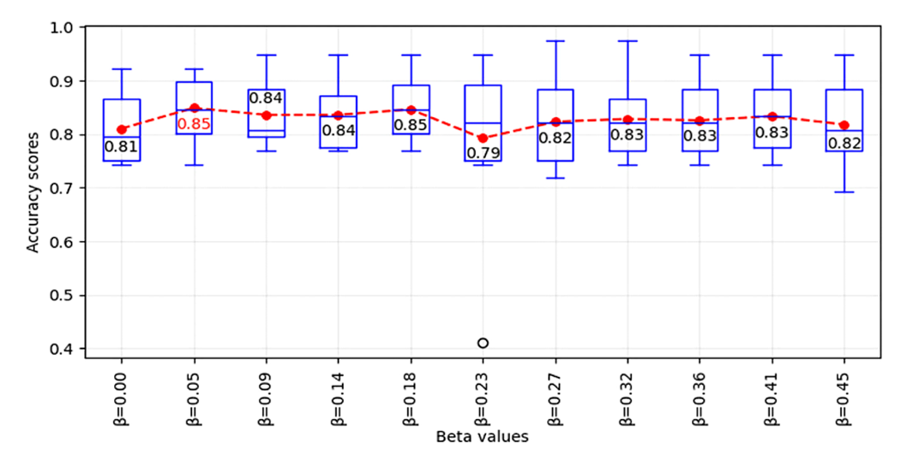

# Multiclass Classification of Alzheimer's Disease Prodromal Stages

This repository provides the implementation of the methods described in the paper **"Multiclass classification of Alzheimer's disease prodromal stages using sequential feature embeddings and regularized multikernel support vector machine"**. The study introduces an advanced framework for distinguishing between the prodromal stages of Alzheimer's disease (AD), namely Cognitive Normal (CN), Mild Cognitive Impairment (MCI), and Alzheimer's Disease (AD), using a unified, multimodal machine learning approach.

  
## Research Significance

Alzheimer's disease remains a major challenge due to its progressive nature and the heterogeneity of its prodromal stages, particularly in the MCI category. Existing approaches often rely on sequential binary classification tasks or direct concatenation of features, which are limited in interpretability and prone to overfitting due to feature imbalance. This study addresses these challenges by proposing a robust, unified multiclass classification framework that leverages both neuroimaging and non-imaging biomarkers.

## Methodological Novelty

1. **Sequential Feature Embeddings**:
   - Adopted the **Ensemble Manifold Regularized Sparse Low-Rank Approximation(EMR-SLRA) by (Zhang et al., 2015)** for dimensionality reduction while preserving the intrinsic geometry of multimodal data. 
   - This method creates a joint low-dimensional embedding from MRI and PET features, capturing interdependencies between modalities and mitigating the curse of dimensionality.

2. **Regularized Multikernel Support Vector Machine (SVM)**:
   - A novel regularization approach ensures balanced contributions from all data modalities, addressing the common issue of dominance by high-dimensional feature sets.
   - This framework enhances model robustness by integrating neuroimaging (MRI, PET) with genetic and cognitive biomarkers (Apoe4, ADAS11, MPACC digits, and Intracranial Volume).

3. **Multimodal Integration**:
   - The study demonstrates the efficacy of combining neuroimaging data with complementary non-imaging biomarkers, achieving state-of-the-art (SOTA) accuracy in multiclass classification tasks.

  

## Results and Impact

The proposed framework achieves SOTA performance with a mean accuracy of **84.87±6.09%** and an F1 score of **84.83±6.12%** for CN vs. MCI vs. AD classification. Furthermore:
- It generalizes well to binary classification tasks, achieving perfect accuracy (100%) in distinguishing between AD and CN cases.
- It significantly improves interpretability and stability compared to existing sequential binary classification methods.

  

### Comparison to Existing Methods
Unlike traditional methods, which often decompose multiclass tasks into sequential binary classifications, this framework directly tackles multiclass classification, enabling more comprehensive insights into the progression of Alzheimer's disease. The regularized multikernel SVM prevents overfitting and ensures a balanced representation of all modalities, offering a scalable solution for similar neuroimaging challenges.
| Articles                  | Samples                        | AD vs. CN    | AD vs. MCI   | CN vs. MCI   | AD vs. MCI vs. CN | Some or all NEW features present? |
|---------------------------|--------------------------------|--------------|--------------|--------------|-------------------|------------------------------------|
| Zhang et al., (2011)      | 51 AD, 99 MCI, 52 CN          | 93.2         | -            | 76.4         | -                 | NO                                 |
| Gray et al., (2013)       | 37 AD, 75 MCI, 35 CN          | 89.0 ± 0.7   | -            | 74.6 ± 0.8   | -                 | NO                                 |
| Liu et al., (2014)        | 51 AD, 99 MCI, 52 CN          | 94.37        | -            | 78.80        | -                 | NO                                 |
| Suk et al., (2014)        | 51 AD, 99 MCI, 52 CN          | 96.18 ± 6.58 | 73.21        | 81.45        | -                 | NO                                 |
| Jie et al., (2015)        | 51 AD, 99 MCI, 52 CN          | 95.38        | -            | 82.99        | -                 | NO                                 |
| Xu et al., (2015)         | 113 AD, 110 MCI, 117 CN       | 94.8         | -            | 74.5         | -                 | NO                                 |
| Liu et al., (2015)        | 85 AD, 102 ncMCI, 67 cMCI,    | 92.89 ± 6.17 | 82.10 ± 4.91 | 82.10 ± 4.91 | 53.79 ± 4.7       | NO                                 |
| Zu et al., (2016)         | 51 AD, 99 MCI, 52 CN          | 95.95        | -            | 80.26        | -                 | NO                                 |
| Ye et al., (2016)         | 51 AD, 99 MCI, 52 CN          | 95.92        | -            | 82.13        | -                 | NO                                 |
| Li et al., (2017)         | 113 AD, 110 MCI, 117 CN       | 97.36        | -            | 77.66        | -                 | NO                                 |
| Tong et al., (2017)       | 37 AD, 75 MCI, 35 CN          | 91.8         | -            | 79.5         | 60.2              | YES                                |
| Singanamalli et al.,      | 52 AD, 71 MCI, 26 CN          | 87           | -            | 86           | 75.16**           | YES                                |
| Wang et al., (2018)       | 99 MCI, 52 CN                 | -            | 75.5         | -            | -                 | NO                                 |
| Kim and Lee, (2018)       | 51 AD, 99 MCI, 52 CN          | 97.12        | -            | 87.09        | -                 | NO                                 |
| Li et al., (2018)         | 113 AD, 110 MCI, 117 CN       | 98.18        | 74.47        | 78.5         | -                 | NO                                 |
| Hao et al., (2020)        | ADNI1-51 AD, 99 MCI, 52 CN    | 97.60 ± 5.03 | -            | 84.47 ± 6.83 | -                 | NO                                 |
| Akramifard et al., (2020) | 156 AD, 338 MCI, 211 CN       | 98.81        | 81.40        | 81.61        | -                 | NO                                 |
| Fang et al., (2020)       | 162 AD, 493 MCI, 251 CN       | -            | 87.69        | -            | 67.69             | NO                                 |
| Lin et al., (2020)        | 102 AD, 315 MCI, 200 CN       | 84.7         | -            | -            | YES               | NO                                 |
| Lin et al., (2021)        | 105 AD, 441 MCI, 200 CN       | 93.4         | -            | 66.7 ± 1.4   | -                 | YES                                |
| Ning et al., (2021)       | ADNI1-93 AD, 200 MCI, 99 CN   | 96.9 ± 3.5   | -            | 86.6 ± 3.4   | -                 | NO                                 |
| Shi et al., (2022)        | 51 AD, 99 MCI, 52 CN          | 96.76 ± 0.05| -            | 80.73 ± 0.09 | -                 | NO                                 |
| Ban et al., (2023)        | 144 AD, 203 MCI, 181 CN       | 98.78        | 86.47        | 78.15        | -                 | NO                                 |
| **OURS**                 | 53 AD, 81 MCI, 60 CN          | 100.00 ± 0.0| 92.96 ± 5.07 | 86.89 ± 4.22 | 84.87 ± 6.09      | YES                                |

### Insights into Neuroimaging and Biomarkers
The study highlights the relative contributions of different brain regions and modalities to classification accuracy, offering valuable insights into the biological underpinnings of Alzheimer's disease. For example:
- The left hippocampus and left amygdala were identified as critical regions for early detection.
- The integration of cognitive scores (e.g., ADAS11) significantly enhanced predictive power.

## Conclusion

This research presents a significant advancement in the field of Alzheimer's disease classification by introducing a unified, interpretable, and high-performing multiclass framework. The integration of advanced embedding techniques with regularized multikernel learning provides a pathway for robust multimodal analyses, with potential applications extending beyond Alzheimer's disease to other neurodegenerative disorders.

## References
Zhang, Lefei, Zhang, Q., Zhang, Liangpei, Tao, D., Huang, X., Du, B., 2015. Ensemble manifold regularized sparse low-rank approximation for multiview feature embedding. Pattern Recognit. 48, 3102–3112. https://doi.org/10.1016/j.patcog.2014.12.016


## Citation
If you use this code or framework, please cite:
```
Oyekanmi O. Olatunde, Kehinde S. Oyetunde, Jihun Han, Mohammad T. Khasawneh, Hyunsoo Yoon. 
"Multiclass classification of Alzheimer's disease prodromal stages using sequential feature embeddings and regularized multikernel support vector machine". NeuroImage, 2024.
DOI: https://doi.org/10.1016/j.neuroimage.2024.120929
```
